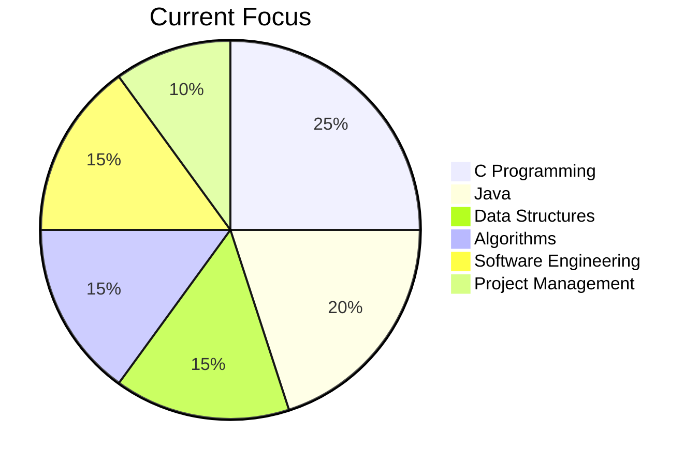

<h1 align="center">Hi, I'm Maysha 👋</h1>

<h3 align="center">
Software Engineering Student | Developer | AI Enthusiast
</h3>

I enjoy learning, building, and exploring new technologies.
Currently focused on programming, software development, problem solving, and AI.

---

## 👩‍💻 About Me

- 🎓 Software Engineering Student
- 💻 Interested in Software Development & AI
- 🌱 Currently improving my C, Java, Git & GitHub skills
- 🧠 Learning Data Structures, Algorithms and OOP
- 🚀 Interested in building practical software and AI-based projects
- 📚 Always exploring new technologies and development tools

---

## 🛠️ Languages & Tools

---

## 💡 Currently Focused On

- C Programming
- Java & Object-Oriented Programming
- Data Structures
- Algorithms
- Git & GitHub
- Software Engineering
- Project Management
- AI-based Projects
- Problem Solving

---

## 📈 Skills Overview

---

## 🔥 GitHub Streak

---

## 🌱 My Goal

> Learn continuously, build meaningful projects, and grow as a software engineer.

---

✨ Learning • Building • Improving ✨

