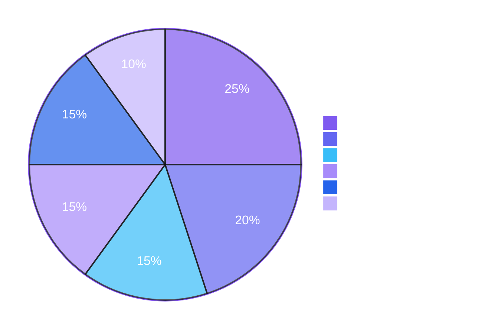

  

  <b>Learning, building, and exploring new technologies.</b> 
  Currently focused on programming, software development, problem solving, and AI.

  
  
  
  

---

## 👩‍💻 About Me

- 🎓 Software Engineering Student  
- 💻 Interested in Software Development & AI  
- 🌱 Currently improving my C, Java, Git & GitHub skills  
- 🧠 Learning Data Structures, Algorithms and OOP  
- 🚀 Interested in building practical software and AI-based projects  
- 📚 Always exploring new technologies and development tools  

---

## 🛠️ Languages & Tools

  

---

## 💡 Currently Focused On

- C Programming
- Java & Object-Oriented Programming
- Data Structures
- Algorithms
- Git & GitHub
- Software Engineering
- Project Management
- AI-based Projects
- Problem Solving

---

## 📈 Skills Overview

<h2>🐦‍🔥 GitHub Analytics</h2>

<table align="center">
  <tr>
    <td align="center">
      
    </td>
  </tr>
</table>

## 🌱 My Goal

> Learn continuously, build meaningful projects, and grow as a software engineer.

---

  ✨ Learning • Building • Improving ✨

